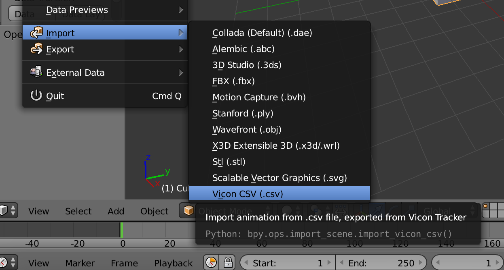
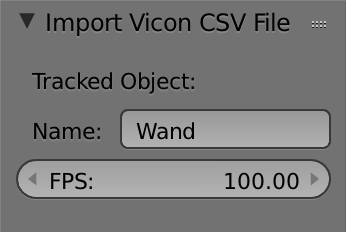
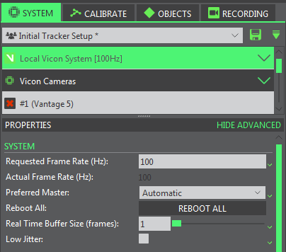
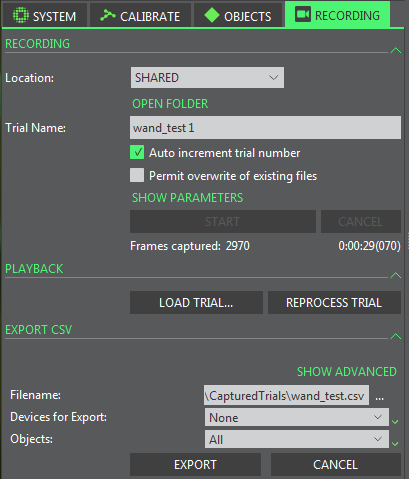
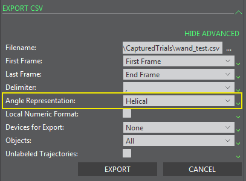

# Vicon Motion Capture Importer
Blender addon for importing motion capture data stored in CSV files exported by [Vicon Tracker](https://www.vicon.com/products/software/tracker).

# Install
Click on the "Clone or Download" button on this Github repo and select "Download ZIP." Then install the addon in Blender via the Addon tab of the User Preferences dialog. Check the checkbox on the newly imported addon to enable it. For more general info about installing and using Blender addons, please see the [Blender Manual](https://docs.blender.org/manual/en/dev/preferences/addons.html)

# Usage

To use the addon, select the Blender object you wish to map the motion tracking data to and select Vicon CSV (.csv) under File->Import. The motion capture data will be used to animate the active object as a series of keyframes.

In the resulting dialog select the CSV file containing the exported motion capture data. On the left sidebar, specify the motion capture data frame rate and optionally the name of the tracked object to import. If no name is given, the addon defaults to the first object to appear in the CSV file.

If the frame rate of the Blender scene does not match the motion capture data's framerate, the addon will perform simple interpolation to compensate.

# Recording Process
These instructions were written for Vicon Tracker version 3.5. Beyond performing the standard object setup and camera calibration workflow, there are a couple extra settings to be aware of before making recordings.

Under the System tab, double check the system frame rate. Since the frame rate is not exported with the motion capture data in the CSV, it will be necessary to enter it manually when importing into Blender.

For the objects that will be tracked, open the advanced properties and ensure the rotation representation is set to "XYZ." This ensures the ordering of exported rotation data is correctly matched when importing into Blender. If this option is not available, press the pause button at the top of the object selection section, or set Vicon Tracker to Offline mode. 

Next, start the recording from the recording tab. Vicon Tracker does not automatically load recorded trials, so use the Load Trial button under playback to open the take you wish to export.

Before exporting, open the advanced settings in the Export CSV section and check that the angle representation is set to Helical. For now, this addon only implements importing Euler rotations. This section also has options for selecting what frames and objects to export. Once everything is set, click Export. The outputted CSV file should be ready for importing into Blender.
